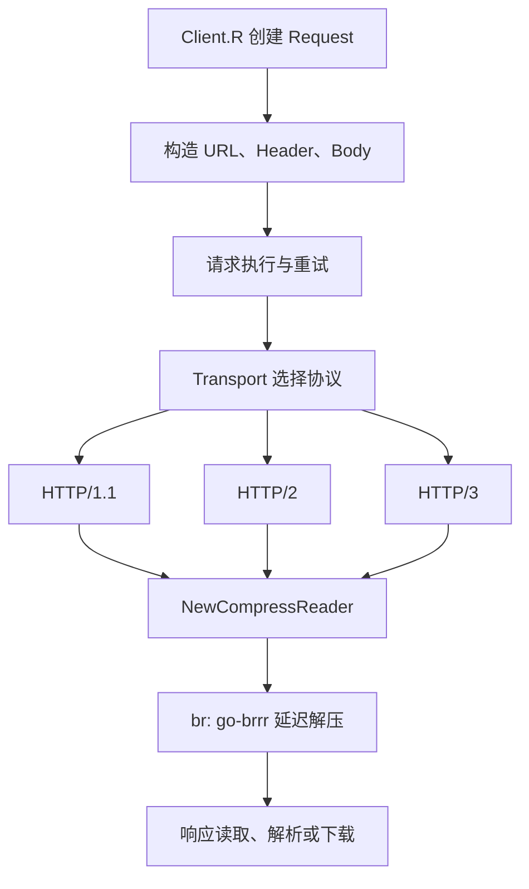

# 代码导览、近期更新与审计

记录日期：2026-10-03。本页记录 `1aaca39` 维护提交及其审计；随后经[静态分析与发布检查](18-static-analysis.md)纳入 `v3.62.0`，模块路径仍保留 `/v3`。

## 近期 fork 更新

| 时间 / 提交 | 变化 | 使用时需要注意 |
| --- | --- | --- |
| 2026-08-14，[af48c83](https://github.com/jwwsjlm/req/commit/af48c83) 及之前的上游同步 | HTTP QUERY、响应大小限制、流式 multipart、公开 RetryOption、自定义 DNS/hosts、SOCKS4/4a、跨域敏感 Header 清理 | 各能力的语义边界见[迁移与兼容](14-migration-compatibility.md) |
| 2026-08-24，[839873e](https://github.com/jwwsjlm/req/commit/839873e)、[3553f5e](https://github.com/jwwsjlm/req/commit/3553f5e) | Query 合并、Header 排序、小响应读取减少分配；补齐边界测试和中文 Wiki | 历史同机基准中 Query 耗时下降约 21–33%，常规 Header 排序下降约 71–86%，1–8 KiB 响应读取下降约 36–60%；这些数字不代表整次 HTTP 请求加速 |
| 2026-08-24，[fdf73b1](https://github.com/jwwsjlm/req/commit/fdf73b1) | uTLS 保留 SNI、mTLS、验证回调、会话缓存等标准配置；Clone 隔离；随机 ALPN/NoALPN、固定 seed、严格 ClientHello 导入 | 指纹 spec 仍决定 ClientHello 形状；HTTP/3 继续走 Go TLS 与 QUIC |
| 2026-08-24，[262eb12](https://github.com/jwwsjlm/req/commit/262eb12)、[0173637](https://github.com/jwwsjlm/req/commit/0173637) | 增加新手指南与双语 API 注释，明确基准指标方向 | `ns/op`、`B/op`、`allocs/op` 均越低越好 |
| 2026-08-30，[8bd12e4](https://github.com/jwwsjlm/req/commit/8bd12e4) | 删除冗余包装层与旧别名，43 个文件净减少 3,189 行 | **存在 API 不兼容变更**：使用 `C()`、`T()`、`Client.R()`；Transport 设置通过 `client.Transport`；详见[已移除的兼容 API](14-migration-compatibility.md#已移除的兼容-api) |
| 2026-10-03，本轮未发布维护 | 替换 Brotli 解压器，更新所有 7 个模块实际使用的依赖，精简内部代码，修复独立示例并纳入 CI，建立 GitNexus 索引 | 本轮不再删除公开 API；示例的本地 `replace` 保持指向当前 checkout |

历史性能数据的环境、基线和复现命令见[性能与稳定性](12-performance-stability.md)。

## Brotli：改了什么、性能依据是什么

共享的 [BrotliReader](../internal/compress/brotli_reader.go) 从 `andybalholm/brotli.NewReader` 切换到 `brrr.NewReader`。H1/H2/H3 的 `Content-Encoding: br` 都通过 [NewCompressReader](../internal/compress/reader.go) 创建这个 Reader，调用方不需要更改 API。

Reader 保持首次读取时初始化，允许 transport 在读取前包装底层 Body；关闭响应时同时释放 `go-brrr` 解码状态并关闭底层 Body，继续返回 Body 的关闭错误。没有增加第二层缓存或对象池。

上游 [go-brrr v1.1.1 的流式解压基准](https://github.com/molecule-man/go-brrr/blob/v1.1.1/README.md#streaming-decompression) 给出多种载荷的几何平均耗时：

| 实现 | 耗时，越低越好 |
| --- | ---: |
| go-brrr | 5.359 ms/op |
| andybalholm/brotli | 9.127 ms/op |

按该上游测试，吞吐比约为 **1.70 倍**，对应耗时下降约 **41.3%**。不能把表中的 `+70.30%` 解读为耗时下降 70.3%。这是上游 Linux/AMD Ryzen 5 7535HS 环境的库级结果；本轮按直接替换的要求只验证正确性，没有测量本机 req 端到端性能。

`andybalholm/brotli v1.2.6` 仍是 uTLS 的间接依赖，`go mod why github.com/andybalholm/brotli` 可查看依赖链。HTTP 响应解压已经切换，无需强行替换 uTLS 内部实现。

## 依赖更新

主模块与 `examples/` 下 6 个独立模块分别执行 `go get -u -t ./...` 和 `go mod tidy`，更新当前导入路径下可用的版本；未使用的历史依赖先通过 tidy 移除。

| 依赖 | 更新前 | 更新后 |
| --- | --- | --- |
| 响应 Brotli 解码器 | andybalholm/brotli v1.2.2 | molecule-man/go-brrr v1.1.1 |
| klauspost/compress | v1.19.2 | v1.20.1 |
| quic-go | v0.61.0 | v0.63.0 |
| golang.org/x/net | v0.58.0 | v0.59.0 |
| golang.org/x/text | v0.41.0 | v0.42.0 |
| golang.org/x/crypto | v0.55.0 | v0.57.0 |
| golang.org/x/sys | v0.47.0 | v0.48.0 |
| OpenTelemetry 核心与 SDK（示例） | v1.44.0 | v1.47.0 |

其他使用中的依赖也经过更新检查，精确版本以各模块的 `go.mod` 为准。qpack `v0.6.0` 等已经是检查时该导入路径的最新版本。uTLS 稳定 tag 仍为 `v1.8.2`，本轮为同步近期修复，明确固定到 `v1.8.3-0.20260924071514-88ba76ae4ee3`，属于未打稳定 tag 的上游提交。后续静态分析确认旧 Jaeger exporter 已弃用，发布前已迁移为 OTLP/HTTP，见[示例配置](../examples/opentelemetry-jaeger-tracing/README.md)。

7 个 `go.mod` 的依赖路径去重后由 **64 项降到 50 项**：清理 16 个残留声明，新增 go-brrr 和 OpenTelemetry log 两项。这个计数是仓库中的显式 `require` 声明，不代表全部传递依赖图或二进制体积。

## Ponytail 审计与执行结果

审计范围包括主模块、内部协议实现、辅助包与 6 个示例模块；用 GitNexus 查找依赖和无调用候选，再用源码检索核实。图谱中没有入边的公开 API、回调和接口方法没有因此被当成死代码删除。

- `delete:` 删除示例中已无使用者的 CycleTLS、fhttp、uquic 等历史依赖声明及校验记录；替代：`go mod tidy`。[示例模块](../examples/)
- `delete:` 删除无引用的 HTTP/2 `sorterPool`、`sorter` 及方法、`httpCodeString`、`bodyAllowedForStatus`；替代：无。实际 Header 排序仍由现有实现处理。[http2.go](../internal/http2/http2.go)
- `stdlib:` 删除只有一个调用者的 `CreateDirectory` 及其预先 `Stat`；替代：下载路径直接调用 `os.MkdirAll`，已有目录成功，文件阻挡路径时返回错误。[middleware.go](../middleware.go)、[util.go](../internal/util/util.go)
- `delete:` 删除从不赋值的 Brotli `berr` 字段及分支；终止错误由解码 Reader 保存。[brotli_reader.go](../internal/compress/brotli_reader.go)

第一轮审计中上述四项改动净减少 76 行生产代码；后续上游功能同步、新测试、注释、文档和 CI 不计入这个数字。依赖净减 14 项按上面的去重声明口径统计。

net: -76 lines, -14 deps possible. 上述方案已执行。

### 上游同步完成后的第二轮审计

再次检查全仓依赖与本轮 diff，重点复查 Chrome spec 工厂、Digest 规范化入口和资源释放。它们分别复用 uTLS、现有 Digest 解析器和 Reader 的 Close，没有新增通用策略层、浏览器注册表或自建对象池。本轮没有发现需继续删除的新增抽象；保留必要的协议数据、输入校验和回归测试。

Lean already. Ship.

注释复查使用 Go AST 对比本轮修改前后的函数体：31 个新增或修改函数均有注释。现有公开 API 检查还验证了 426 个公开可调用 API 的中英文注释，全部通过。

## surf、uTLS、resty 近期更新核查

检查范围为 2026-08-30 至 2026-10-03 的默认分支提交与最新发布，同时比较本项目此前固定版本的差异。

| 来源 | 上游变化 | 本项目处理 |
| --- | --- | --- |
| [surf v1.0.206](https://github.com/enetx/surf/releases/tag/v1.0.206)，9 月 10 日 | Chrome 152、trust_anchors、GREASE 签名算法、每连接随机扩展顺序；开放自定义 spec 的 shuffle | 在现有 spec factory 上复用 uTLS Chrome 公共字段，补齐 152 扩展并同步 UA；使用 fresh spec 和库内 shuffle，未引入 surf 依赖或另一层 builder |
| [uTLS 88ba76a](https://github.com/refraction-networking/utls/commit/88ba76ae4ee304e4d12e738b5e156a16ee6fe542)，9 月 24 日 | 合入 Go 1.26 TLS 更新、共享 session race 修复、HRR 后 PSK binder 重算、AlwaysIncludePSK、ConnectionMetrics；较旧 tag 新增 Firefox 148 / Safari 26.3 | 固定该提交，更新预设，保留 CurveID/HelloRetryRequest；Chrome 增加真实 PSK 并省略空 PSK。未为没有现有需求的 metrics/AlwaysIncludePSK 再增加 req 包装 API |
| [resty v3.0.0-rc.4](https://github.com/go-resty/resty/releases/tag/v3.0.0-rc.4)，9 月 6 日 | BaseURL 尾斜杠、池化 buffer/切片所有权、Digest RFC 7616、multipart 提前响应、SSE/hedging/LB 生命周期等修复 | 在 req 复现并修复三类问题：空路径保留 BaseURL 尾斜杠；继承 Header 使用独立切片；Digest 的 qop 去空白并拒绝缺少 nonce。继续使用现有 `icholy/digest` 解析器 |
| [resty 9 月后续提交](https://github.com/go-resty/resty/commits/v3/?since=2026-09-07&until=2026-10-03) | Retry-After 接受所有 HTTP-date、curl body 副本关闭、Windows LB 错误识别 | req 没有对应的内置 Retry-After、curl 生成、SSE、hedging 或 LB 子系统，本轮不为同步而新建这些功能 |

Query 合并中的切片仅被 `url.Values.Encode` 读取，保留原有浅合并优化；Header 会由调用方继续修改，因此需要复制。multipart 使用 `io.Pipe`，编码器随读端关闭结束写入；这与 resty 的实现不同，没有直接移植其 goroutine 控制代码。

Chrome 152 的 trust-anchor 列表取自 surf 所记录的 Google Chrome 桌面构建，字节及顺序固定；只打乱扩展外层顺序。Android/iOS 仍只切换 Header/UA，不声称与对应移动浏览器完整 TLS/QUIC 指纹一致。自定义 spec 如需随机扩展，可在现有 `SetTLSFingerprintSpecFactory` 的工厂中调用 `utls.ShuffleChromeTLSExtensions`，不需要新增 API。

上游修复参考：[surf per-connection shuffle](https://github.com/enetx/surf/commit/7da0502899af06f8318f95e632797cb2ac0c6c20)、[resty BaseURL](https://github.com/go-resty/resty/pull/1191)、[resty 内存所有权](https://github.com/go-resty/resty/pull/1202)、[resty Digest](https://github.com/go-resty/resty/pull/1203)。surf 配置数据的 MIT notice 已保留在根目录 `THIRD_PARTY_NOTICES.md`。

## 用代码图谱定位实现

下图是概念流程；重试、重定向和 transport 内部连接重试各有独立条件。



| 要查的行为 | 主要入口与实现 |
| --- | --- |
| Client 默认配置与 Request 生命周期 | [client.go](../client.go)、[request.go](../request.go)、[response.go](../response.go) |
| 参数合并、multipart、响应解析与下载 | [middleware.go](../middleware.go)、[parallel_download.go](../parallel_download.go) |
| H1 连接、协议选择与 Alt-Svc 回退 | [transport.go](../transport.go) |
| H2 SETTINGS、Header 顺序及响应 | [internal/http2/transport.go](../internal/http2/transport.go)、[internal/header/sort.go](../internal/header/sort.go) |
| H3 连接、请求流与响应解压 | [internal/http3/transport.go](../internal/http3/transport.go)、[stream.go](../internal/http3/stream.go) |
| 浏览器 profile、TLS 配置转换 | [client_impersonate.go](../client_impersonate.go)、[tls_fingerprint.go](../tls_fingerprint.go)、[tls_utls.go](../tls_utls.go) |
| DNS、代理、重定向和认证 | [dns.go](../dns.go)、[internal/socks](../internal/socks/)、[redirect.go](../redirect.go)、[digest.go](../digest.go) |
| trace 和 dump | [trace.go](../trace.go)、[dump.go](../dump.go)、[internal/dump](../internal/dump/) |

GitNexus 已注册本地仓库 `req`，索引保存在忽略提交的 `.gitnexus/`。新 checkout 先运行 `npx gitnexus analyze --skip-skills --no-stats`；已有 runner 时可用：

```sh
node .gitnexus/run.cjs status
node .gitnexus/run.cjs analyze --index-only
node .gitnexus/run.cjs impact NewBrotliReader --direction upstream --repo .
node .gitnexus/run.cjs detect-changes --scope all --repo .
```

MCP 可以使用 `query` 定位流程、`context` 查看符号、`impact` 检查调用者。Brotli 的构造链连接三个协议，因此图谱给出的影响级别为 HIGH；接口 `Read`/`Close` 的静态调用解析存在缺口，仍需结合源码和测试。索引时也有调用候选与流程数量截断，缺少图边不能证明代码无用。

本次尝试了 `gitnexus wiki --provider codex --lang chinese`，但本机 CLI 的模型路由返回 404，未成功自动生成 Wiki。本页由本次代码审阅结合 GitNexus 图谱整理，并并入现有中文 Wiki。修复本机模型配置后，可用该命令在 `.gitnexus/wiki/` 生成独立版本；不要直接覆盖已有专题文档。

## 验证

本机环境：Windows/amd64、Go 1.26.8；模块最低 Go 版本继续以 `go.mod` 为准。

- 主模块 `go test ./... -count=1`、`go vet ./...`、`go test -race ./... -count=1` 通过。
- `go mod verify` 通过；[上游同步回归检查](../upstream_sync_test.go) 覆盖 BaseURL、Header 隔离、Digest、编码后的 Chrome ClientHello，以及三个新版浏览器 preset 的真实本地 TLS 握手和 Chrome 会话复用。
- 6 个独立示例模块各自执行 `go test ./... -count=1` 通过；这些模块没有单元测试，此步骤验证编译与 vet，不会运行示例的公网请求。
- [Brotli 回归检查](../internal/compress/brotli_reader_test.go) 使用独立 C 参考编码器生成的 96 KiB 数据，覆盖分片读取、截断/非法输入、源错误传播、底层 Body 替换，以及读取前/部分读取后的关闭。
- CI 在 Linux 和 Windows 的现有矩阵中补上独立示例模块检查。本机结果不代替远端 CI 结果。
